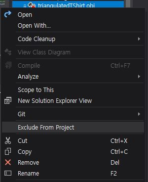

# ClothSimulation
Jeehoon Hyun, started April 2019.

First attempt of cloth simulation using OpenGL 3.3, GLFW. Implemented physics simulation based on the euler steps method and the damped mass spring model. Got help from here: https://graphics.stanford.edu/~mdfisher/cloth.html
This is a simple simulation where two points of the shoulder is fixed and the cloth is drooping due to gravity.

## Demo
https://www.youtube.com/watch?v=tA5-Y_i0c2A&feature=youtu.be  
---update May 1st, 2019---  
Added a sphere within the shirt to make it look like a breast. (Basic collision detection + resolution):  
https://www.youtube.com/watch?v=fn-xVN4-P2s&feature=youtu.be

## How to build and run on Windows10 x64 using Visual Studio 2019
I primarily used Windows and Visual Studio 2019 for developing this project. However, because it is based on the OpenGL setup boilerplate of Kevin Fung (read acknowledgement below), it is not necessary limited to building on Windows. Linux and Mac environment is also supported. Anyway, to build it on Windows using Visual Studio 2019, use the following code in the cmd.
```
git clone --recursive https://github.com/peterhyun/ClothSimulation.git
cd ClothSimulation
cd Build
cmake -G "Visual Studio 16 2019" ..
```
Furthermore, within the Visual Studio 2019 IDE, the .obj file in ```Glitter/Assets``` had to be excluded from the project, and the ```Treat Warning As Errors``` had to be unticked in the project file property settings for building the Assimp library.




After building the whole solution is successful, go to the directory ```Build/Glitter/Debug``` and now you can see the ```Glitter.exe``` file. Run it, and enjoy!
## Directory Structure & Explanation
.  
├── Build  
├── Glitter/  
│   ├── Assets/  
│   │   └── triangulatedTShirt.obj  
│   ├── Headers/  
│   │   ├── Camera.h  
│   │   ├── EulerStepSolver.h  
│   │   ├── OBJReader.h  
│   │   ├── Particle.h  
│   │   ├── ParticleSystem.h  
│   │   └── Shader.h  
│   ├── Shaders/  
│   │   ├── model_loading.fs  
│   │   └── model_loading.vs  
│   ├── Sources/  
│   │   └── main.cpp  
│   └── Vendor/  
├── screenshots/  
├── CMakeLists.txt  
└── Readme.md  

The tree above shows the relevant files/folders of my project. 

## Acknowledgement
The basic OpenGL Setup boilerplate of this code is from Kevin Fung's Glitter repository: https://github.com/Polytonic/Glitter
With this boilerplate, you can test this code in Windows, Linux, or Mac environment. The only dependency it requires is CMake.

-------------------------------------------------------------------------------------------------------------------
## MIT License of the Glitter Boilerplate
>The MIT License (MIT)

>Copyright (c) 2015 Kevin Fung

>Permission is hereby granted, free of charge, to any person obtaining a copy of this software and associated documentation files (the "Software"), to deal in the Software without restriction, including without limitation the rights to use, copy, modify, merge, publish, distribute, sublicense, and/or sell copies of the Software, and to permit persons to whom the Software is furnished to do so, subject to the following conditions:

>The above copyright notice and this permission notice shall be included in all copies or substantial portions of the Software.

>THE SOFTWARE IS PROVIDED "AS IS", WITHOUT WARRANTY OF ANY KIND, EXPRESS OR IMPLIED, INCLUDING BUT NOT LIMITED TO THE WARRANTIES OF MERCHANTABILITY, FITNESS FOR A PARTICULAR PURPOSE AND NONINFRINGEMENT. IN NO EVENT SHALL THE AUTHORS OR COPYRIGHT HOLDERS BE LIABLE FOR ANY CLAIM, DAMAGES OR OTHER LIABILITY, WHETHER IN AN ACTION OF CONTRACT, TORT OR OTHERWISE, ARISING FROM, OUT OF OR IN CONNECTION WITH THE SOFTWARE OR THE USE OR OTHER DEALINGS IN THE SOFTWARE.
